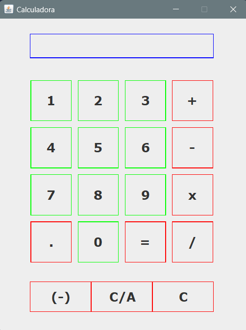

# Calculator GUI 
This calculator is made with Java Swing and was one of my first individual projects that I did in Java. I wanted the calculator to have a graphical user interface (GUI) instead of being runned in a console, so the task could have an added point of difficulty.

# 

<h3>Preview</h3>

####
#